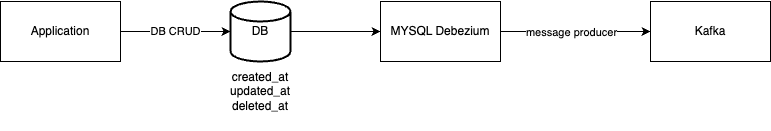
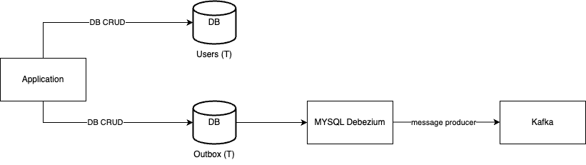
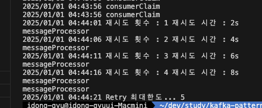

# Kafka Essential

## Folder Architecture

```sh
## simple
|- producer 				## producer 코드 (nodejs)
|- consumer				## consumer 코드 (golang)

## advacned
|- producer-lambda			## producer 코드 람다 코드 (javascript)
|- consumer-batch-listener		## consumer Batch 코드 (golang)

## cdc / outbox pattern
|- producer-cdc				## producer cdc 코드 (javascript + mysql)
|- producer-outbox			## producer outbox 코드 (javascript + mysql)
|- consumer-mysql			## consumer mysql 코드 (golang + mysql)
```

## Exec

```sh
	## pub-sub
	make up

	## cdc up
	make cdc-up

	## outbox up
	make outbox-up
```

## Infra / Container

- [kafka docker-compose.yml 코드](./infra/docker-compose.yml)
- [api docker-compose.yml 코드](./docker-compose.yml)

## Producer Code (nodejs)

```javascript
import { Kafka, Partitioners } from "kafkajs";
import { getConfig } from "./env.confg.js";

class KafkaConfig {
  _kafkaConn = undefined;

  constructor(clientId, brokers) {
    if (!this._kafkaConn) {
      console.log("kafak connect...");
      this._kafkaConn = new Kafka({
        clientId,
        brokers: brokers.split(","),
        // requestTimeout: 10000,
        // retry: 5,
      });
    } else {
      console.log("kafka is already connect...");
    }
  }

  async isExistTopic(topic) {
    const admin = this._kafkaConn.admin();

    try {
      await admin.connect();

      const topics = await admin.listTopics();
      if (topics.includes(topic)) {
        return true;
      }

      return false;
    } catch (e) {
      console.error(e);
    }
  }

  async producer(value) {
    const topic = getConfig().KAFKA_TOPIC;
    const p = await this._kafkaConn.producer({
      createPartitioner: Partitioners.LegacyPartitioner,
    });

    try {
      // const isExistsTopic = await this.isExistTopic(topic);
      // console.log(isExistsTopic);

      await p.connect();
      await p.send({
        topic,
        messages: [{ key: value.id, value: JSON.stringify(value) }],
      });
    } catch (e) {
      console.error(e);
    } finally {
      await p.disconnect();
    }
  }
}

export const kafkaConn = new KafkaConfig(
  getConfig().KAFKA_CLUSTER_NAME,
  getConfig().KAFKA_BROKERS
);
```

## Consumer Code (Golang)

```golang
func NewKafka() kafkaConn {

	kafkaBrokers := strings.Split(KAFKA_BROKERS, ",")

	config := sarama.NewConfig()
	config.Consumer.Return.Errors = true
	config.Version = sarama.V3_6_0_0

	consumer,err := sarama.NewConsumer(kafkaBrokers, config)
	if err != nil {
		panic(err)
	}

	return kafkaConn{
		consumer : consumer,
	}
}

func (k kafkaConn) Consume(topic string)  {

	partitionList, err := k.consumer.Partitions(topic)
	if err != nil {
		panic(err)
	}

	for _, partition := range partitionList {
		pConsumer, err := k.consumer.ConsumePartition(topic, partition, sarama.OffsetNewest)
		if err != nil {
			panic(err)
		}

		go func(pc sarama.PartitionConsumer) {
			for msg := range pc.Messages() {
				fmt.Println("[consume] topic : ",topic, string(msg.Value))
			}
		}(pConsumer)
	}
}

func (k kafkaConn) Close() error {
	log.Panicln("Closing kafka consumer...")
	return k.consumer.Close()
}
```

## Consumer 성능개선 (BatchListener)

```golang
func NewKafka() kafkaConn {

	kafkaBrokers := strings.Split(KAFKA_BROKERS, ",")

	config := sarama.NewConfig()
	config.Consumer.Return.Errors = true
	config.Version = sarama.V3_6_0_0

	config.Consumer.Offsets.AutoCommit.Enable = false
	config.Consumer.Offsets.Initial = sarama.OffsetNewest // 최신 메시지부터 수동커밋...

	consumerGroup, err := sarama.NewConsumerGroup(kafkaBrokers, KAFKA_CONSUMER_GROUP, config)
	if err != nil {
		panic(err)
	}

	return kafkaConn{
		consumer: consumerGroup,
	}
}

type BatchListener struct{}

// Cleanup implements sarama.ConsumerGroupHandler.
func (b *BatchListener) Cleanup(sarama.ConsumerGroupSession) error {
	log.Panicln("[Cleanup] 파티션 재할당")
	return nil
}

// Setup implements sarama.ConsumerGroupHandler.
func (b *BatchListener) Setup(sarama.ConsumerGroupSession) error {
	log.Println("[Setup] 파티션 할당")
	return nil
}

func messageProcessor(session sarama.ConsumerGroupSession, batch []*sarama.ConsumerMessage) {
	for _, msg := range batch {
		log.Println("Topic : ", msg.Topic, "Values : ", string(msg.Value))
		session.MarkMessage(msg, "")
	}

	log.Println("Commit... ", len(batch))
}

// ConsumeClaim implements sarama.ConsumerGroupHandler.
var (
	_BATCH_SIZE = os.Getenv("BATCH_SIZE")
)

func (b *BatchListener) ConsumeClaim(session sarama.ConsumerGroupSession, claim sarama.ConsumerGroupClaim) error {

	BATCH_SIZE ,_ := strconv.Atoi(_BATCH_SIZE)
	BATCH_TIMEOUT := 5 * time.Second


	var batch []*sarama.ConsumerMessage
	batchTimer := time.NewTimer(BATCH_TIMEOUT)

	for {
		select {
			case msg := <- claim.Messages():
				batch = append(batch, msg)
				if len(batch) >= BATCH_SIZE {
					messageProcessor(session, batch)
					batch = nil
					batchTimer.Reset(BATCH_TIMEOUT)
				}

			case <-batchTimer.C:
				if len(batch) >0 {
					messageProcessor(session, batch)
					batch = nil
				}
				batchTimer.Reset(BATCH_TIMEOUT)
		}
	}
}

func (k kafkaConn) ConsumeBatch() {

	topics := strings.Split(KAFKA_TOPICS, ",")
	go func() {

		for {
			if err := k.consumer.Consume(context.TODO(), topics, &BatchListener{}); err != nil {
				panic(err)
			}
		}
	}()
}

func (k kafkaConn) Close() error {
	log.Panicln("Closing kafka consumer...")
	return k.consumer.Close()
}
```

## Consumer


## Consumer (Batch Listener)


## Pub / Sub Application


## Producer use lambda


[Lambda Code](./producer-lambda/main.go)

## CDC Pattern (\*\*)

- 단점
  - 주기적으로 DB에서 값을 읽어오기때문에 -> 변경사항이 잦다면 -> 인지하기 어려움 (이슈 발생 여지 존재)



## Outbox Pattern (\*\*)



- 특징
  - outbox라는 별도의 테이블을 활용 (별도의 Queue로 대체)
  - DB에 테이블 CRUD 후, outbox라는 테이블에 구성
  - 두개의 테이블 CRUD 후 transaction... (별도의 모듈이 필요할듯함)
- 장점
  - 데이터를 outbox라는 테이블에 immutable하게 사용함 -> 매번의 변경사항을 확인할 수 있음
  - 나름 이상적인 패턴임...
- 단점
  - 좀더 구현하기가 복잡할 수 있음 (별도의 테이블을 구성..., immutable 하게 구성해야 함) -> 주기적으로 데이터를 지워줘야 함 (스토리지)

## Consumer 측에서 발생할수 있는 이슈

### Exception

- JsonProcessingTimeoutException
  - 원인 : Json 파싱 실패
  - 해결 : 컨슈머 측에서는 해결 불가 (이미 파싱이 불가한거라... 코드수정) -> Not Retryable
- TimeoutException
  - 원인 : DB를 쓴다거나, API 요청을 한다던가, 브로커가 안된다던가 (사실 너무 많음)
  - 해결 : <b>주로 일시적인 문제일 가능성이 높음</b> - Retryable

### 해결방법 (Retry)

- Retry
  - 너무 자주 하면 서버에 부하가 많이 온다.
  - Fixed ( 1초 대기 -> 1초 대기 -> 1초 대기) = x만큼 대기
  - Exponential ( 2초대기 -> 4초대기 -> 8초대기) = x \* 2 만큼 대기 (서버부하를 줄일 수 있음...)



```go
// Exponential
func mustRetry(retryCount int, maxRetryCount int, backoff int) {

	// exit
	if retryCount == maxRetryCount {
		log.Fatalf("Retry 최대한도... %d", retryCount)
	}

	retryBackoffDuration := retryCount * backoff
	log.Printf("재시도 횟수 : %d 재시도 시간 : %ds",retryCount, retryBackoffDuration )
	time.Sleep(time.Duration(retryBackoffDuration))
}
```

- Dead Letter Topic
  - Consume이 실패한 메시지를 새로운 토픽에다가 메시지를 넘긴다.
  - Dead Letter와 비슷함... (SQS)

## Issue

- EC2에 구성된 카프카 local에서 접근 시, Connection Error

```json

// Error
 [cause]: KafkaJSConnectionError: Connection error:
      at Socket.onError (/Users/idong-gyu/dev/study/kafka-in-go/producer/node_modules/kafkajs/src/network/connection.js:210:23)
      at Socket.emit (node:events:518:28)
      at emitErrorNT (node:internal/streams/destroy:169:8)
      at emitErrorCloseNT (node:internal/streams/destroy:128:3)
      at process.processTicksAndRejections (node:internal/process/task_queues:82:21) {

// 해결방법

// KAFAK_CFG_ADVERTISED_LISTENERS 의 EXTERNAL 주소가 localhost로 되어있었음
 - KAFKA_CFG_ADVERTISED_LISTENERS=CLIENT://kafka1:19092,EXTERNAL://localhost:9092

// Public IP 주소로 바꿔주자...
 - KAFKA_CFG_ADVERTISED_LISTENERS=CLIENT://kafka1:19092,EXTERNAL://<EC2 퍼블릭 IP>:9092
```

### Cosnumer의 과도한 리밸런싱을 줄이는 방법

- Consumer Group ID가 리밸런싱에 미치는 영향

  - 고정된 Group ID를 사용하면 리밸런싱을 최소화 할 수 있음
  - static membership

```sh
	group.instance.id=consumer-*
```

    - Session Timeout 값 조정
    - 너무짧으면 Consumer가 일시적으로 끊겨서 리밸런싱 발생

```sh
# default 45s (이를 늘리면 불필요한 리밸런싱을 줄일 수 있음)
session.timeout.ms=60000 # 60s
```

    - Auto Offset Reset
    - latest보다는 earlest가 예측가능성을 높여서 리밸런싱을 최소화 할 수 있음

```sh
auto.offset.reset=earliest
```

    - reblance protocol 설정
    - RangeAssignor, StickyAssignor, CooperativeStickyAssignor 중 **CooperativeStickyAssignor**를 사용하면 최소한의 리밸런싱만 발생함

```sh
partition.assignment.strategy=org.apache.kafka.clients.consumer.CooperativeStickyAssignor
```

✅ Consumer가 재시작해도 리밸런싱 없음
✅ 일시적인 네트워크 장애에도 세션 유지
✅ Kubernetes/Docker 환경에서 안정적으로 운영 가능

- 즉, Static Membership을 사용하면, consumer가 일단 남아있어 리밸런싱이 발생하지 않음... (consumer-batch-listener에 구성되어있음)

```golang
func NewKafka() kafkaConn {

	kafkaBrokers := strings.Split(KAFKA_BROKERS, ",")

	config := sarama.NewConfig()
	config.Consumer.Return.Errors = true
	config.Version = sarama.V3_6_0_0

	groupId := ""
	hostname, _ := os.Hostname()

	// static membership
	if IS_STATIC_MEMBERSHIP == "true" {
		groupId = fmt.Sprintf("consumer-%s", hostname)
	}else{
		groupId = hostname
	}

	config.Consumer.Offsets.AutoCommit.Enable = false
	config.Consumer.Offsets.Initial = sarama.OffsetNewest // 최신 메시지부터 수동커밋...

	// static membership
	// config.Consumer.Group.InstanceId = "consumer-"


	consumerGroup, err := sarama.NewConsumerGroup(kafkaBrokers, groupId, config)
	if err != nil {
		panic(err)
	}

	return kafkaConn{
		consumer: consumerGroup,
	}
}
```

## Reference

- <a href="https://kafka.js.org/docs/getting-started">Kafakjs</a>

```

```
